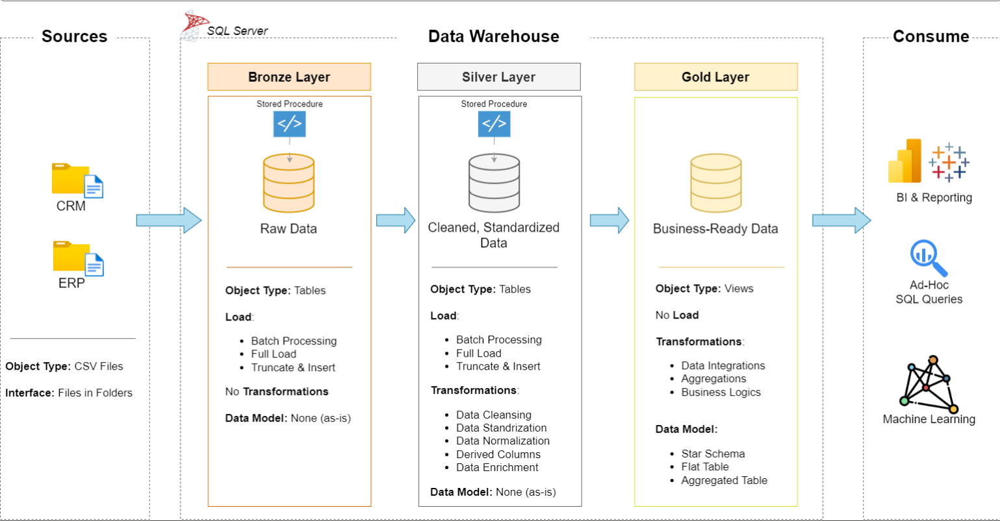
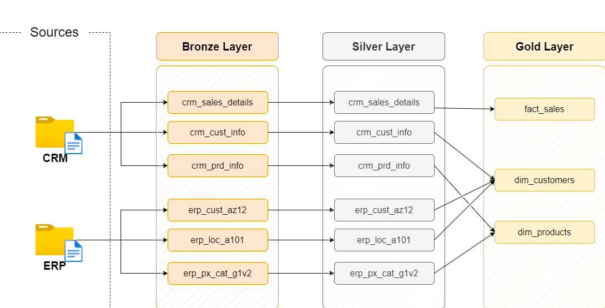

# Data Warehousing and Analytics Project by Soumajit M
Welcome to the **Data Warehouse and Analytics Project** repository! 🚀  
This project demonstrates a comprehensive data warehousing and analytics solution, from building a data warehouse to generating actionable insights. Designed as a portfolio project, it highlights industry best practices in data engineering and analytics.

---
## 🏗️ Data Architecture

The data architecture for this project follows Medallion Architecture **Bronze**, **Silver**, and **Gold** layers:

1. **Bronze Layer**: Stores raw data as-is from the source systems. Data is ingested from CSV Files into SQL Server Database.
2. **Silver Layer**: This layer includes data cleansing, standardization, and normalization processes to prepare data for analysis.
3. **Gold Layer**: Houses business-ready data modeled into a star schema required for reporting and analytics.

## 📖 Project Overview

This project involves:

1. **Data Architecture**: Designing a Modern Data Warehouse Using Medallion Architecture **Bronze**, **Silver**, and **Gold** layers.
2. **ETL Pipelines**: Extracting, transforming, and loading data from source systems into the warehouse.
3. **Data Modeling**: Developing fact and dimension tables optimized for analytical queries.
4. **Analytics & Reporting**: Creating SQL-based reports and dashboards for actionable insights.

## 📈 Data Lineage Overview

This project follows a structured, multi-layered data architecture to ensure clean, reliable, and traceable data processing:

Sources: Raw data is ingested from CRM and ERP systems, including customer info, sales data, product details, and location information.

Bronze Layer: This layer stores the raw, untransformed data as-is from the source systems. Tables like crm_cust_info, erp_loc_a101, and others serve as the foundational data layer.

Silver Layer: Data is cleaned, validated, and lightly transformed in this layer. It represents trusted datasets ready for analysis or further modeling. Silver tables maintain a 1:1 relationship with Bronze but with better quality and structure.

Gold Layer: The most refined layer, containing business-ready data models such as fact_sales, dim_customers, and dim_products. These are derived by combining and transforming relevant Silver layer tables to support reporting and analytics.

## 👥 Acknowledgment

Special thanks to <a href="https://www.linkedin.com/in/baraa-khatib-salkini/" target="_blank">Baraa Khateeb</a>
, Data Architect at Mercedes-Benz, whose insights on modern data architectures and best practices (shared through his YouTube channel) greatly influenced the design and implementation of this project. He was like my virtual senior manager throughout the project.  

## 🛡️ License

This project is licensed under the [MIT License](LICENSE). You are free to use, modify, and share this project with proper attribution.

## 🌟 About Me

Hi, I'm <a href="https://www.linkedin.com/in/soumajit-mondal-49011a19b/" target="_blank">Soumajit Mondal</a>. I'm a tech enthusiast with an entrepreneurial edge. I'm currently pivoting into Data Analytics to build meaningful, scalable solutions that solve real-world problems.
With a background in business strategy, team leadership, and client relations from my time at Knackdits, I bring a unique, people-centric approach to technical challenges. I’m pursuing a Bachelor’s in Computer Applications (BCA), sharpening my software development and database management skills while aligning my passion for technology with data-driven decision-making.

I'm especially interested in the intersection of business insights and modern tech, and I strive to bridge that gap by combining analytical thinking with creative problem-solving.
